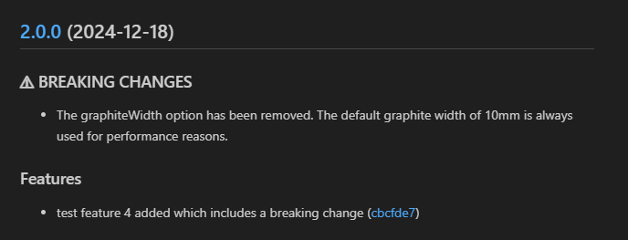
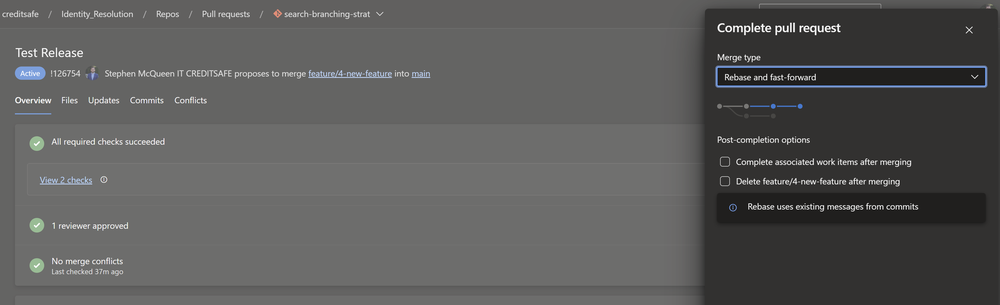

<h1 align="center" style="border-bottom: none;">Universal Search Platform</h1>
 

# Adopting Conventional Commits

### What Are Conventional Commits?

**Conventional Commits** is a lightweight convention for writing commit messages. By applying a structured format to each commit, we can:

- Automatically determine the next semantic version for a release.
- Generate human-readable changelogs from the commit history.
- Help everyone quickly understand the scope and nature of each change.

**Format:**
`<type>(<scope>): <subject>`

- **type**: Describes the kind of change (e.g., `feat`, `fix`, `docs`, `style`, `refactor`, `test`, `perf`).
- **scope**: Optional context for the change (e.g., `core`, `company`, `director` etc).
- **subject**: A brief description, written in lowercase and imperative form.

**Example:**  
`feat(core): add advanced filtering to search results`  
`fix(company): correct pipeline yaml syntax docs: update API usage guide`

**Breaking Changes**
To highlight a commit includes breaking changes you **MUST** include the text "BREAKING CHANGE:" in the commit description e.g.

Commit Title

- feat: test feature 4 added which includes a breaking change

Commit Description:

- BREAKING CHANGE: The graphiteWidth option has been removed.
  The default graphite width of 10mm is always used for performance reasons.

  Example output in changelog:  
  

### Why Use Conventional Commits?

1. **Automated Changelog Generation**:  
   Using a structured format means tools can parse your commit messages and produce a changelog automatically.

2. **Semantic Versioning**:  
   Certain keywords (like `feat` or `fix`) guide whether the next release is a major, minor, or patch version.

3. **Improved Communication**:  
   A consistent commit style makes it easier to understand the nature and impact of changes at a glance.

### Generating & Maintaining a Changelog

With Conventional Commits in place, tools such as Semantic Release can:

- Parse commit messages.
- Determine the release version from commit types.
- Update `CHANGELOG.md` automatically.
- Optionally publish new releases without manual intervention.

This ensures your changelog is accurate, complete, and always up-to-date.

Our project leverages [semantic-release](docs/https://semantic-release.gitbook.io/) to automate the versioning and release process, ensuring that each new set of changes is properly reflected in our version numbers and `CHANGELOG.md`. This works alongside our Conventional Commits practice, allowing releases to be determined by commit types (`feat`, `fix`, etc.).

**Key Points of Our Setup:**

- **Branches:**  
  We’ve configured semantic-release to operate on the `main` branch, ensuring that only changes merged into the main line trigger new releases.

- **Repository URL:**  
  Specifying the repository URL ensures that semantic-release has a reference to the remote repo for generating correct commit and compare links.

- **Commit Parsing (parserOpts):**  
  Our `parserOpts` are customized to handle both:

  - Standard Conventional Commits.
  - Squash-merged PR commits which have a prefix like `Merged PR 1234:`.

  Additionally, we extract `Related work items` referenced in commit footers and link them to Azure DevOps work items.

- **Plugins:**

  1. **@semantic-release/commit-analyzer:**  
     Determines the type of release (patch, minor, major) based on commit messages.
  2. **@semantic-release/release-notes-generator:**  
     Generates release notes from commit messages, using the same parsing rules as the commit analyzer.  
     We’ve customized `presetConfig` to generate issue links to Azure DevOps work items and compare links that point to the Azure DevOps branch comparison UI.

  3. **@semantic-release/changelog:**  
     Updates `CHANGELOG.md` with the newly generated release notes.

  4. **@semantic-release/git:**  
     Commits the updated `CHANGELOG.md` back into the repository so our documentation stays in sync with the latest releases.

### How & When to use conventional commits

I'm of the opinion that using conventional commits whilst working on a particular feature or bugfix can become obstructive and get in the way of producitivity. Therefore this standard is only enforced when its time to merge into main.

There's **2** choices for merging into main.

The first option is for a single branch (feature, bugfix etc) merging directly into main. In this scenario we recommend using the Azure Devops Pull Request title as your conventional commit e.g. feat(core): added some new logic. The commit lint pipeline job will check the title to ensure it conforms to the conventional commits standard and if successful, will suggest you use **Squash Commit** merge.

Option two is where you have a release branch which contains multiple branches of changes. In this case its important to **Squash Commit** each branch into release branch and use the conventional commit standard in the PR title. When it comes to raising a PR for the release branch into main, a squash commit isn't appropriate since Azure Dev Ops does NOT include the squashed commits in the description. Therefore the commit linter is blind to multiple changes being added and you end up with a single entry in the changelog based on the PR title. Therefore, its best to use a **Rebase and fast forward** merge for the PR of release branch into main. This will ensure you get a separate entry for each commit in the release branch and things won't be overlooked or lost.

  

Example release branch with squashed commit feature/bugfix branches:  
  

Example main branch **after** release branch is rebase merged via PR:  
  

Generated changelog entry:  
  

### Enforcing Conventional Commits in Our CI

We have integrated a commit linting step in our Azure DevOps pipeline to ensure PR titles **OR** commit messages (in that order) follow the Conventional Commits standard. If the PR title does not pass the check, it will then check if all commits on the PR source branch comply (assuming they will be rebased into main).

If they don’t comply, the pipeline will fail, preventing non-conforming changes from merging into **MAIN**.

Example of failures:
  
  

Example of passing check for a release branch:
  
