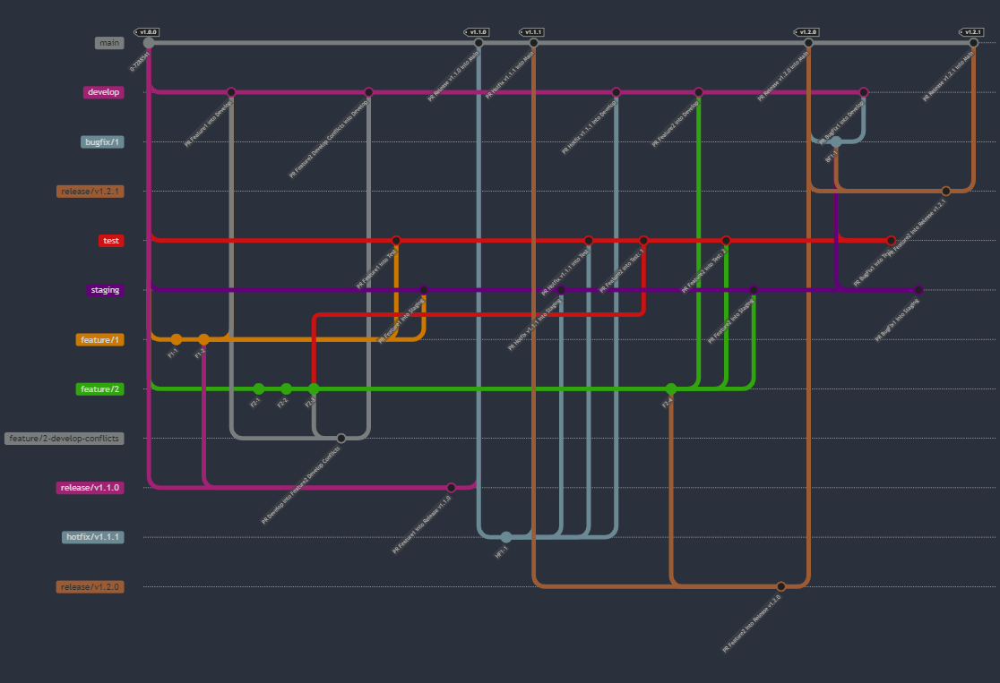

# USP Company Search


[](https://dev.azure.com/creditsafe/Identity_Resolution/_build/latest?definitionId=4247&branchName=test)

# Introduction

This project contains the core dynamic query generator logic for company search.

## Prerequisites

- Node version 20.11.0
- Git

# Running locally

To run this project in local machine, you'll need to initialise the git submodules to clone in the static configuration files. This can be done by running the following command in a Git CLI

`git submodule update --init --recursive`

## Package.json scripts

### Run command

We use the npm package dotenv and a ".env" file to inject environment variables when running locally. Please note, this file is **NOT** used in any deployed environment. Instead they use variables defined in terraform.

In order to get the env variables loaded, use the built in (as of Node 20) env command e.g.

`node --env-file=.env ./localTests/handlerTestCases.mjs`

### Run unit tests

Use the following command to run the unit tests & code coverage:

`npm run coverage`

### Run build

This project uses esbuild to transpile and bundle the code into a single file. There are a couple of considerations with the current setup:

- It does not support "top level await" calls. This is because the esbuild bundler does not support it yet.
- It uses a pre & post script to dynamically modify the code to workaround an issue caused by the OTEL lambda layer. For more information see next section.

# OpenTelemetry Lambda Layer

This project utilises the OpenTelemetry Lambda Layer to provide distributed tracing. The layer is added to the lambda via the terraform configuration. The layer is configured to use the AWS X-Ray exporter. An issue arose during deployment:

\```json
{
"errorType": "TypeError",
"errorMessage": "Cannot redefine property: handler",
// truncated stack trace for brevity
}
\```

this issue is caused by a dependency of `otel-extension` called `shimmer`.

Here's the relevant part of the stack trace for clarity:

\```text
at defineProperty (/opt/otel-extension/node_modules/shimmer/index.js:14:10)
\```

The fix: Both the `opentelemetry-js-contrib` and `aws-otel-lambda` GitHub repos suggest changing from ES6 exports to CommonJS `module.exports`.

**❌ Incorrect Way:**

\```javascript
export const handler = () => {
// your code here
};
\```

**✅ Correct Way:**

\```javascript
const handler = () => {
// your code here
};
module.exports = { handler };
\```

With the above in mind, the pre build script modifies the handler.mjs export to use CommonJS. The post build script then changes it back to ES6. This is a workaround until the issue is fixed in the `shimmer` package.

# Project structure

This app incorporates the [service layer pattern](https://en.wikipedia.org/wiki/Service_layer_pattern) and tries to adhere to the following principles:

- Create Service Classes/Modules:

  - For each distinct functionality or related group of functionalities, create a service. A service should be responsible for a specific set of tasks. For instance, in a blogging platform, you might have UserService, PostService, and CommentService.

- Avoid Fat Services:

  - While services should encapsulate business logic, avoid making them too large or complex. If a service starts to grow too much, consider whether it can be logically split into multiple services.

- Keep Services State-less:

  - Services should be stateless, meaning they shouldn't maintain any state between calls. This makes them more predictable and easier to test.

- Dependency Injection:

  - If a service depends on another service or component (like a database connection), inject that dependency. Dependency injection makes testing easier and reduces tight coupling between services and their dependencies.

- Separate Data Access:

  - Services should not contain direct data access code (like SQL queries). Instead, use Data Access Objects (DAOs) or Repositories to abstract away the data source.

- Error Handling:

  - Handle exceptions at the service layer, but ensure that they're meaningful for the caller. For instance, instead of throwing a generic database exception, throw a more meaningful "UserNotFoundException".

- Testing:

  - Since the service layer encapsulates core business logic, it's crucial to write unit tests for it. With the separation of concerns and dependency injection, testing services should be straightforward.

- Documentation:
  - Provide clear documentation for each service method, explaining its purpose, input parameters, return values, and any exceptions it might throw.

# Branching Strategy



## Overview of Branching Strategy (Mermaid Diagram Summary)

Our project follows a structured branching strategy, ensuring robust development, testing, and release processes. Below is a summary of the key events and practices outlined in our Mermaid diagram:

### Initial Setup and Versioning

- **Main Branch**: We start with the `main` branch as our primary, stable codebase.
- **Version Tagging**: The initial commit is tagged as `v1.0.0`, adhering to semantic versioning principles for clarity and consistency.

### Development and Feature Integration

- **Long-Lived Branches**: We create `develop`, `test`, and `staging` branches from `main`. These branches are long-lived and serve specific roles:
  - `develop`: For integrating features and preparing them for testing.
  - `test`: For thorough testing of new features and fixes.
  - `staging`: For final checks and simulations before production.
- **Feature Branch Workflow**: Features are developed in their respective branches (e.g., `feature/1`, `feature/2`):
  - Features are based off `main` to ensure they include the latest stable code.
  - After completion, features are merged into `develop`, then `test`, and finally `staging`. This sequence ensures comprehensive testing and validation before reaching production.

### Handling Merge Conflicts

- **Conflict Resolution Branches**: In cases of merge conflicts (e.g., `feature/2-develop-conflicts`), we create a specific branch to resolve these conflicts. This keeps the main feature branch clean and focused.

### Release Process

- **Release Branches**: For each release, a separate branch is created (e.g., `release/v1.1.0`). This branch:
  - Is used to prepare the code for the next release.
  - Is tagged with the new version number upon merging into `main` (e.g., `v1.1.0`), following semantic versioning.

### Hotfixes and Bugfixes

- **Hotfix Branches**: For urgent fixes (e.g., `hotfix/v1.1.1`), we create hotfix branches:
  - These are branched from `main` to address immediate production issues.
  - Once fixed, they are merged back into `main`, as well as into `develop`, `test`, and `staging` to ensure consistency across all environments.
- **Bugfix Branches**: For non-urgent fixes (e.g., `bugfix/1`), we follow a similar approach as feature branches, ensuring they pass through all stages of testing and staging.

### Version Tagging

- **Semantic Versioning**: Each significant merge into `main` is tagged with a version number, indicating the nature of the change (major, minor, or patch).

### Justifications and Best Practices

This branching strategy is aligned with industry best practices, ensuring:

- **Isolation of Features**: Separate feature branches allow for focused development and easier code reviews.
- **Robust Testing**: By sequentially merging features into `develop`, `test`, and `staging`, we ensure thorough testing and validation.
- **Conflict Management**: Dedicated branches for resolving merge conflicts prevent disruption in the main feature branches.
- **Clear Release Process**: Separate release branches allow for final adjustments and version tagging, which is crucial for traceability and rollback capabilities.
- **Quick Response to Production Issues**: Hotfix branches enable rapid responses to critical production issues without disturbing the ongoing development.
