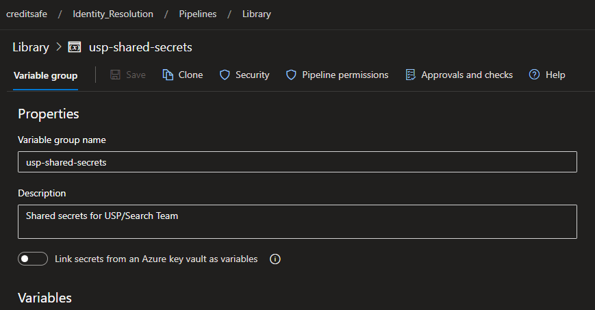
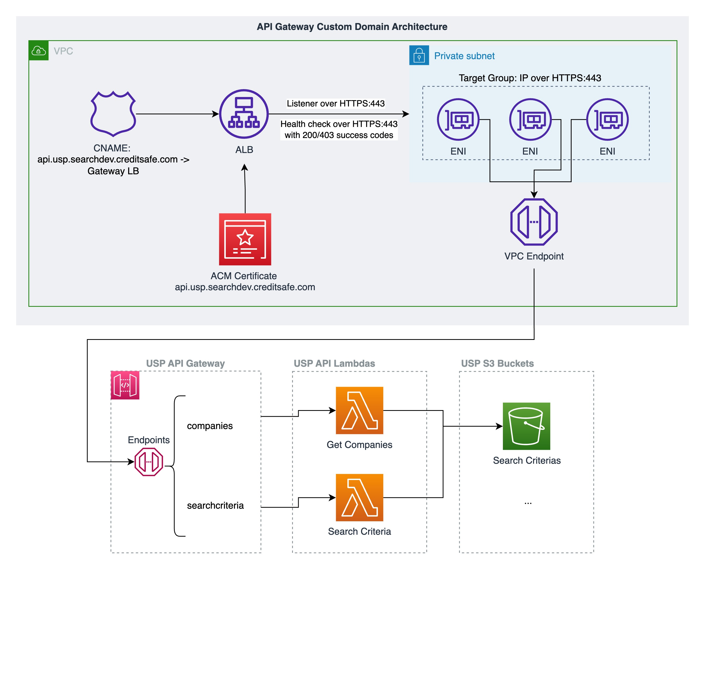
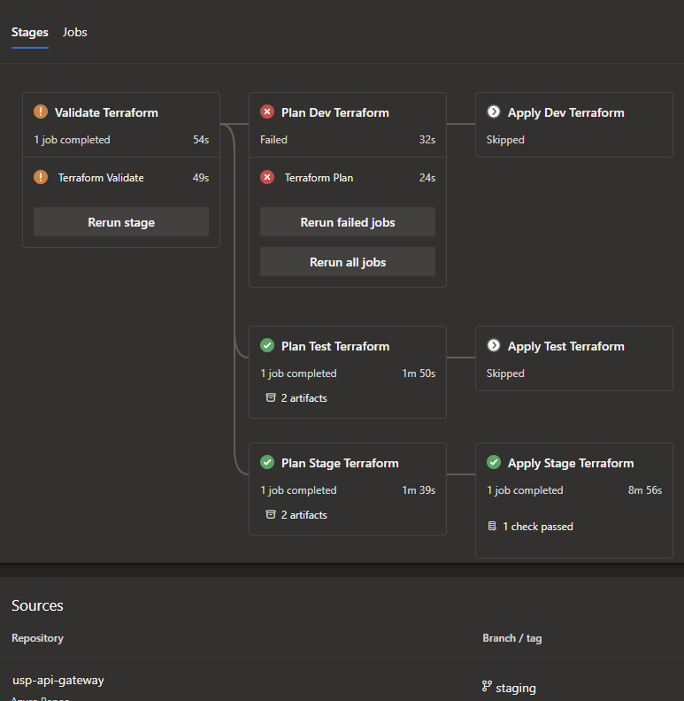

# Project Name
usp-infra

## Table of Contents
1. [Introduction](#introduction)
2. [Architecture](#architecture)
2. [Usage](#usage)
4. [Variables](#variables)
5. [Outputs](#outputs)
---

## Introduction
This repository contains the Terraform code to deploy the infrastructure for the USP project. It does **not** contain the infrastructure for ingestion. The terraform is separated by high level, logical resources to make maintenance easier.

The build pipeline makes use of the terraform actions templates provided by platform engineering team. It also makes use of an azure dev ops pipeline library to inject variables into terraform, via the pipeline.

## Architecture

TODO, include architecture diagram generated by terraform graph.

## Usage

We have four environments: dev, test, stage and prod. Each environment has its own .tfvars file with the variables needed to deploy the infrastructure. The variables are described in the next section.

The build pipeline is configured to trigger for a commit on each of the above environment branches. For each run it will run validate and plan for **each environment**. If the plan is successful, it will run apply for **the specific environment branch**.

For example, if you commit to the dev branch, the pipeline will run validate and plan for dev, test, stage and prod. If the plan is successful, it will run apply for dev.

---
